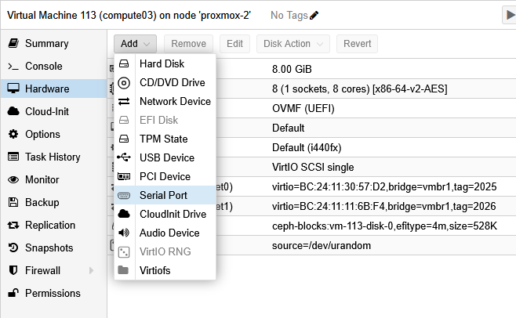

# Console on Serial Port

## Overview
Proxmox gives the possibility to add a serial device
(a virtual serial device) to a VM.

From a VM point of view, this virtual devices shows as if
it was a real serial port and Linux provides a ```/dev/ttyS*```
character device to manage it[^1]

From the outside however it does not seem possible to exchange
with the VM through this channel unless using the ```qm terminal <VMID>```
command on the hypervisor itself.

What is missing is a piece of sofware that links this hypervisor terminal
to a IP/port and adhoc protocol (IPMI, Redfish...).

FIn this page we will just see with HPCM how to use what's serial console is available on
Proxmox and decide where a VM should push its *console* messages.

## VM configuration

We detailed the VM setup previously, we just need to add, if not already done, a *serial* device:



##  HPCM configuration

From HPCM standpoint, it's possible to modify the console port an existing compute node is expected to uses like this:

>
> **cm node set --console-device ttyS0 -n compute03**
>

We could also setup a new node template like the [template2.txt](../resources/template2.txt)
and upload it to the HPCM Database this way:

>
> **cm node template update -c template2.txt**
>

Then use this ```vm-serial``` template in place of the ```vm``` one we used earlier.

## Proxmox side

let's stop the ```compute03``` VM, ssh to the hypervisor and there, run
the ```qm terminal <VMID>```:

```
root@proxmox-2:~# qm terminal 113
VM 113 not running
root@proxmox-2:~#
```

OK, we have first to start the VM, this can be done running ```qm start <VMID>``` right before:

```
root@proxmox-2:~# qm start 113 && qm terminal 113
/dev/rbd0
starting serial terminal on interface serial0 (press Ctrl+O to exit)


```

First, note that only a **CTRL+O** sequence will let you exit from this terminal line.

After a few tens of seconds, the terminal clears and we can follow the boot process from that serial interface:

```
>>Start PXE over IPv4.
  Station IP address is 10.20.25.2

  Server IP address is 10.20.25.254
  NBP filename is cm-ipxe-direct-x86_64.efi
  NBP filesize is 201728 Bytes
 Downloading NBP file...

  NBP file downloaded successfully.
BdsDxe: loading Boot0001 "UEFI PXEv4 (MAC:BC24113057D2)" from PciRoot(0x0)/Pci(0x12,0x0)/MAC(BC24113057D2,0x1)/IPv4(0.0.0.0,0x0,DHCP,0.0.0.0,0.0.0.0,0.0.0.0)
BdsDxe: starting Boot0001 "UEFI PXEv4 (MAC:BC24113057D2)" from PciRoot(0x0)/Pci(0x12,0x0)/MAC(BC24113057D2,0x1)/IPv4(0.0.0.0,0x0,DHCP,0.0.0.0,0.0.0.0,0.0.0.0)
iPXE initialising devices...ok


iPXE 1.0.0+ -- Open Source Network Boot Firmware -- https://ipxe.org
Features: DNS HTTP iSCSI TFTP VLAN AoE EFI Menu
CM iPXE Embedded iPXE script, ifopen
CM iPXE Embedded iPXE script, Interface Information:
net0: bc:24:11:30:57:d2 using SNP on SNP-0000:00:12.0 (Ethernet) [open]
  [Link:up, TX:0 TXE:1 RX:0 RXE:0]
  [TXE: 1 x "Network unreachable (https://ipxe.org/28086090)"]
CM iPXE IP is already set, no need to dhcp.
CM iPXE IP and route information:
net0: 10.20.25.2/255.255.255.0
net0: fe80::be24:11ff:fe30:57d2/64
CM iPXE set time with NTP if possible using 10.20.25.254
CM iPXE Load Node Specific iPXE Script with HTTP:
CM iPXE chain http://10.20.25.254/boot/ipxe-direct/cm/10.20.25.2.ipxe
http://10.20.25.254/boot/ipxe-direct/cm/10.20.25.2.ipxe... ok
CM iPXE Direct Boot node-specifc config script
CM iPXE: load kernel
http://10.20.25.254/boot/images/rocky8.10/vmlinuz-4.18.0-553.el8_10.x86_64... ok
CM iPXE: load initrd
http://10.20.25.254/boot/images/rocky8.10/initramfs-4.18.0-553.el8_10.x86_64.img...

<OUTPUT TRUNCATED>

[  OK  ] Started System Logging Service.
         Stopping NTP client/server...
[  OK  ] Stopped NTP client/server.
         Starting NTP client/server...
[  OK  ] Started NTP client/server.
[  OK  ] Started CM Configuration.
         Starting Crash recovery kernel arming...
         Starting SMC Heartbeat Service...
[  OK  ] Started SMC Heartbeat Service.
[  OK  ] Reached target Multi-User System.
         Starting Update UTMP about System Runlevel Changes...
[  OK  ] Started Update UTMP about System Runlevel Changes.
[  OK  ] Started Crash recovery kernel arming.

Rocky Linux 8.10 (Green Obsidian)
Kernel 4.18.0-553.el8_10.x86_64 on an x86_64

compute03 login:
Rocky Linux 8.10 (Green Obsidian)
Kernel 4.18.0-553.el8_10.x86_64 on an x86_64

compute03 login: root
Password:
Last login: Thu Jan 22 17:05:52 from 10.20.25.254
[root@compute03 ~]#

```


[^1]: replace the star (*) by a number, like in here ```/dev/ttyS0```

| [Prev](3-hpcm-node-setup.md) | [top](../README.md)   | [Next](5-proxmoxbmc.md) |
|:-----------------------------|:---------------------:|------------------------:|
