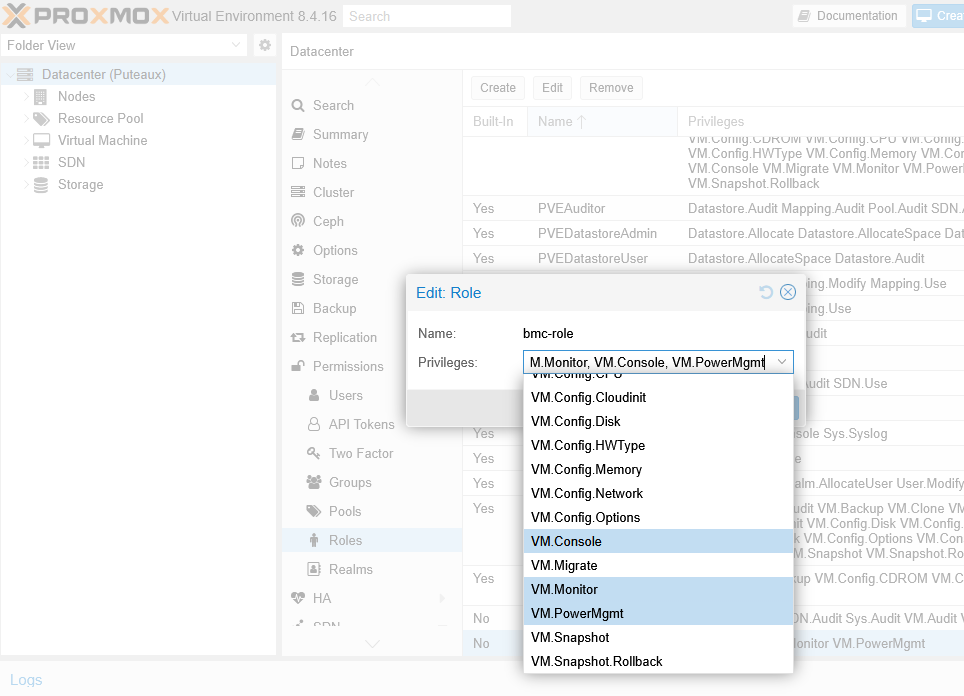
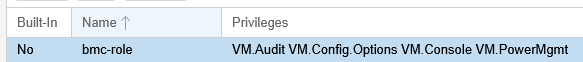
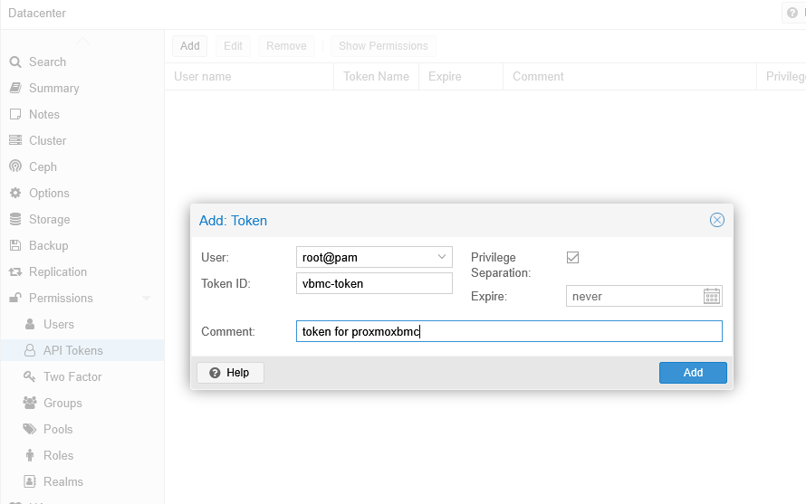
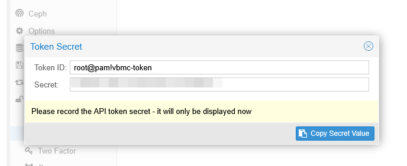
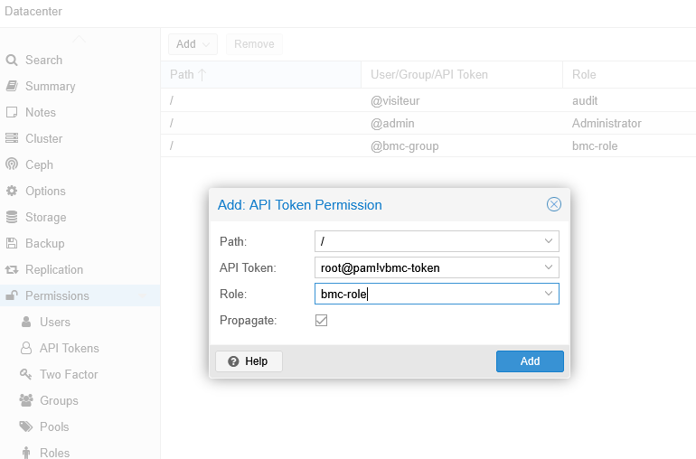
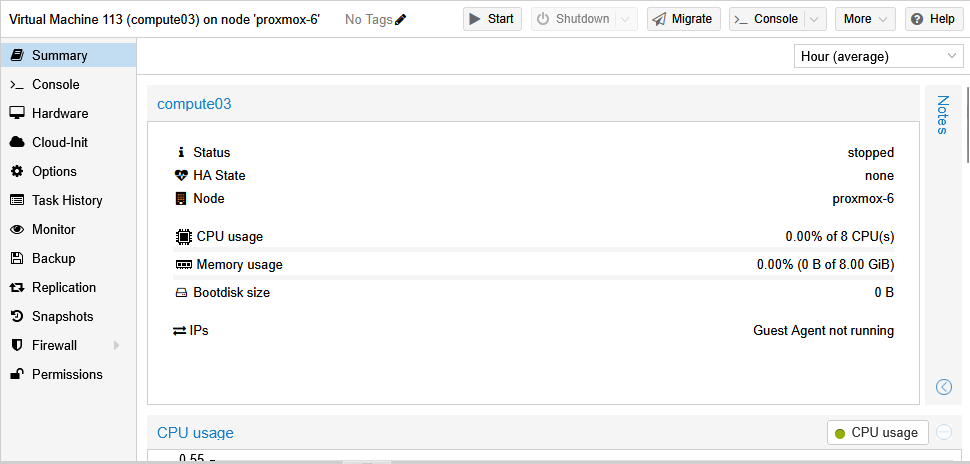
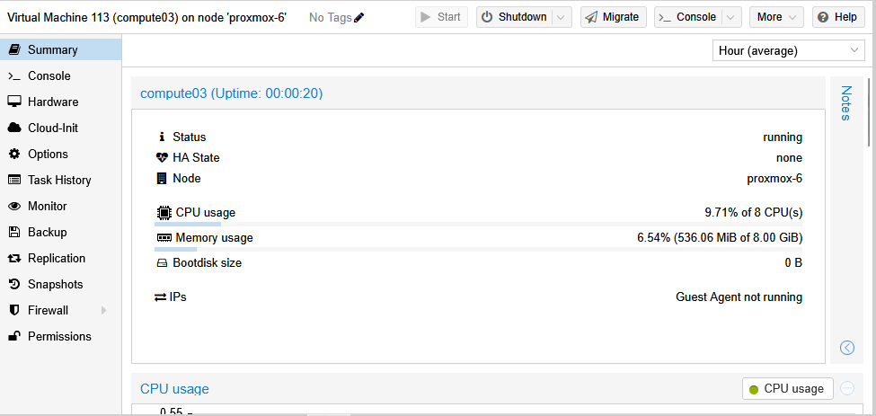

# Proxmox BMC

## Presentation

[Proxmoxbmc](https://github.com/agnon/proxmoxbmc) is a project inheriting from
VirtualBMC which was active on Openstack.

*Proxmoxbmc* relies on [proxmoxer](https://github.com/proxmoxer/proxmoxer) which
is a wrapper of the Proxmox Virtual Environment (PVE in the following) REST API for the Python language.

This page describes how to setup and use *Proxmoxbmc* and follows this structure:
- Architecture consideration
- Proxmoxer installation
- Proxmoxbmc
  - Installation
  - Manual execution
  - Integration with systemd
- Proxmoxbmc to PVE authentication
  - Adding a new PVE role
  - Creating an API token
  - Assigning role to the token
- Proxmoxbmc configuration with PVE
- Proxmoxbmc IPMI testing
- Conclusion

## Architecture consideration

As the fundation is the PVE REST API, it's only necessary to install *proxmoxer* and *proxmoxbmc* on
a single node that has access, on one side, to all the PVE hypervisor, and on the other side
is accessible from HPCM and the eventual SU_leader(s) node(s).

Here *node* means *VM*, of course.

From HPCM point of view, the vBMC node should be reachable through the head-bmc network

## Proxmoxer installation

We just have to install it, no daemon to run:

>
> pip install proxmoxer
>
> pip install requests
>
> pip install paramiko
>
> pip install openssh_wrapper
>

As an alternative, Debian provides a package. Using the official distributions is more secured than replying
on PyPI so you should prefer this if you chose Debian as the OS of the vBMC node:

>
> apt-get install python3-proxmoxer
>


## Proxmoxbmc

### Installation

We will stick to the Debian OS to install *proxmoxbmc* following the short doc provided for its installation:

>
>   apt-get install python3-pip python3-venv git -y
>
>   apt-get update && apt-get install python3-pip python3-venv
>
>   cd ~
>
>   git clone https://github.com/agnon/proxmoxbmc.git
>
>   cd proxmoxbmc
>
>   python3 -m venv .env
>
>   source .env/bin/activate
>
>   pip install -r requirements.txt
>
>   python -m setup install
>

### Manual execution

Proxmoxbmc relies an a daemon, named **pbmcd** we can run manually this way:

```
   root@vbmc:~# cd ~/proxmoxbmc
   root@vbmc:~/proxmoxbmc# source .env/bin/activate
   (.env) root@vbmc:~/proxmoxbmc# pbmcd
   (.env) root@vbmc:~/proxmoxbmc#
```

### Integration with systemd

As this *pbmcd* daemon should be fired each time the VM boots, it would be
better to have the init process (the horrible octopus *systemctl* under Debian) doing
that for us:

```
root@vbmc:~# cat > /etc/systemd/system/pbmcd.service <<EOF
[Unit]
Description = pbmcd service
After = syslog.target
After = network.target

[Service]
ExecStart = /root/proxmoxbmc/.env/bin/pbmcd --foreground
Restart = on-failure
RestartSec = 2
TimeoutSec = 120
Type = simple
q
[Install]
WantedBy = multi-user.target

EOF
root@vbmc:~#
```

then we can activate the service with:
```
root@vbmc:~# systemctl enable --now pbmcd
```

Let's check the service is running as expected:
```
root@vbmc:~# systemctl status pbmcd
● pbmcd.service - pbmcd service
     Loaded: loaded (/etc/systemd/system/pbmcd.service; enabled; preset: enabled)
     Active: active (running) since Fri 2026-01-23 12:21:09 CET; 1min 50s ago
   Main PID: 909 (pbmcd)
      Tasks: 3 (limit: 2314)
     Memory: 20.5M
        CPU: 238ms
     CGroup: /system.slice/pbmcd.service
             └─909 /root/proxmoxbmc/.env/bin/python /root/proxmoxbmc/.env/bin/pbmcd --foreground

janv. 23 12:21:09 vbmc systemd[1]: Started pbmcd.service - pbmcd service.
janv. 23 12:21:10 vbmc pbmcd[909]: 2026-01-23 12:21:10,222 909 INFO ProxmoxBMC [-] Started pBMC server on port 50891
root@vbmc:~#
```

## Proxmoxbmc to PVE authentication

Proxmoxbmc will have to access PVE API to realize the operations it will receive through IPMI. This means
to authenticate to the Proxmox cluster API. This authentication relies **tokens**.

The principle is to:
- create a role and give it a set of privileges
- create a token
- associate the token to the role

### Adding a new PVE role

First, we define a **role** having access to **at least** the following rights:
- VM.PowerMgmt (power on/off the VM)
- VM.Console (access the OS from the BMC)
- VM.Audit (read the VM status)
- VM.Options (changing boot PXE/Disk...)

Go to menu ```Datacenter | Permissions | Roles``` and add a new role as illustrated below:



Check that the proper privileges have been assigned to the role. You should see at least the following ones:



### Creating an API Token

Then go to the menu ```Datacenter | Permissions | API Tokens```and add a new token
checking the box ```privilege separation```[^1]:



Once validated, a new window displays the API token secret. Copy it in a secured place, it will not
show again (you would be good to delete this token an create a new one in case of loss).



### Assigning role to the token

Last with Proxmox authentication, after having created:
- a bmc-role
- an API token

We must now assign the *bmc-role* to the token we have created, for it receives some privileges, since
we checked the *privilege separation*[^1] box when creating the token. For that go to the
```Datacenter | Permissions``` menu and *Add an API Token permission* as described here:



> [!Note]
> The *Path* (here above set to */*) can be used in option to restict the permission to
> certains objects (VM or pool of VM for example).
> One could organize all the VMs to be managed by proxmoxer to be set to a Proxmox *pool* named *HPCM*
> and only allow the token to act on objects of that pool, by specifying the *Path* equal
> to */pool/HPCM*.

[^1]: Checking the box ```privilege separation``` means that this token has not been assigned
any privilege (privilege separated from the user account it has been created on). If unchecked
the token would have the privileges of the user it has been created for, here *root* which would
not be very secured!!! One could also create a dedicated user for the *proxmoxbmc* software, with
restricted privileged and associate the token to this account without *privilege separation*...


## Proxmoxbmc Configuration with PVE

To provide a BMC feature to a given VM the *pbmcd* daemon must also be configured.
This is done using the **pbmc** command, which is available in the venv where proxmoxer
has been installed previously:

```
root@vbmc:~# cd ~/proxmoxbmc
root@vbmc:~# source .env/bin/activate
(.env) root@vbmc:~/proxmoxbmc# pbmc add --username admin --password password --port 623 --address 10.13.30.253 --proxmox-address proxmox-6.ezmeral.edrusb.org --token-user root@pam --token-name vbmc-token --token-value xxxxxxxx-xxxx-xxxx-xxxx-xxxxxxxxxxxx 113
```

In the previous output:
- we assigned TCP port 623 to the BMC of the compute03 we had created for HPCM PXE boot earlier. This
  VM has a VMID of 113, where from the last argument on the command-line
- the --address is *not* necessary, it restricts the interfaces on which the BMC will be reachable (by default vBMC is reachable by all interfaces)
- the username and password are the one to use to connect to the virtual BMC service on this port. HPCM will need them to authenticate to the vBMC.
- the proxmox-address is the hostname/IP address of one of the hypervisor of the PVE cluster. If a Virtual IP is available over the different hypervisors
  constituing this PVE cluster, this would be more robust to use it, instead of the one of a particular hypervisor of the cluster.
- the token-user, token-name and token value are to be fetched from the token we just
  created above.


Now, let's check the status of our first BMC service:

```
(.env) root@vbmc:~/proxmoxbmc# pbmc list
+------+--------+--------------+------+
| VMID | Status | Address      | Port |
+------+--------+--------------+------+
| 113  | down   | 10.13.30.253 |  623 |
+------+--------+--------------+------+
(.env) root@vbmc:~/proxmoxbmc#
```

in the previous output we see our virtual BMC for the VM which ID is 113 (compute03 VM).
The status ```down``` is not those of the VM but of the virtual BMC service, so we
must first start it:

```
(.env) root@vbmc:~/proxmoxbmc# pbmc start 113
(.env) root@vbmc:~/proxmoxbmc# pbmc list
+------+---------+--------------+------+
| VMID | Status  | Address      | Port |
+------+---------+--------------+------+
| 113  | running | 10.13.30.253 |  623 |
+------+---------+--------------+------+
(.env) root@vbmc:~/proxmoxbmc#
```

The running status of a BMC service is maintained when *proxmoxbmc* is restarted, so we
will not have to redo it in the future.

## Proxmox IPMI testing

On the HPCM admin node, let's install *ipmitool*:

>
> dnf install ipmitool -y
>

Now let's check the power status of the VM 113
```
[root@hpcm1 ~]# ipmitool -I lanplus -U admin -P password -H 10.13.30.253 power status
Chassis Power is off
[root@hpcm1 ~]#
```

And this is coherent with the current status as displayed from the proxmox GUI:



Now, let's power on the VM 113:

```
[root@hpcm1 ~]# ipmitool -I lanplus -U admin -P password -H 10.13.30.253 power on
Chassis Power Control: Up/On
[root@hpcm1 ~]# ipmitool -I lanplus -U admin -P password -H 10.13.30.253 power status
Chassis Power is on
[root@hpcm1 ~]#
```

let's check the result retured by *ipmitool* is coherent with the proxmox GUI:




And it is! The VM 113 is now really powered on!

## Conclusion

We now have an VM with a BMC implemented as a virtual machine running the *pbmcd* daemon,
thanks to the *proxmoxbmc* software. But *proxmoxbmc* is only able to provide standard
BMC (listening on port UDP/623) to only one VM.

For that reason we provide here [Multibmc](6-multibmc.md) program to enhance the features
of *proxmoxbmc* and reach that goal.

| [Prev](4-console-on-serial.md) | [top](../README.md)   |  [Next](6-multibmc.md)        |
|:-------------------------------|:---------------------:|------------------------------:|
