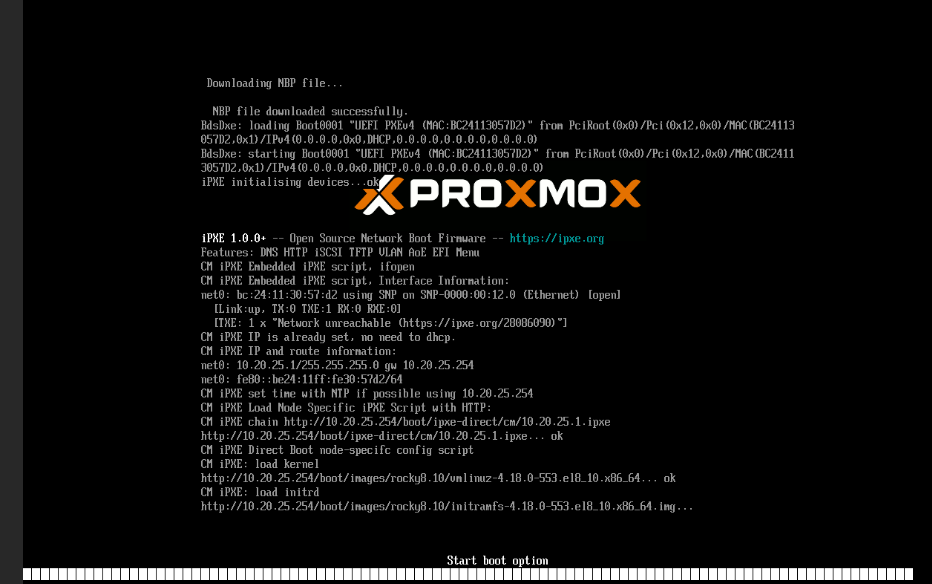

# HPCM Tweeking

Some VM specific aspects have to be taken into account:
- Unlike real compute nodes, VM do not have the BMC nor iLO stuf that let HPCM
  controlling their power.
- The second point concerns the console port, VM usually have virtual display and use
  a ```/dev/tty0``` in place of a ```/dev/ttyS0``` (serial interface) something HPCM
  expects by default.


## HPCM node template configuration for VM

To cope with that once and for all compute node, let's setup this node template file
[template1.txt](../resources/template1.txt), where we define:
- conserver_logging to false, because HPCM does not have direct access to the VM console port
- switch_mgmt_network to false, because the hypervisor internal network is managed manually,
  though if you have classical physical switches this might be reconsidered
- console_device to tty1, that's the first virtual Linux console and should display the boot
  information to the VM console (else the boot message are not visible after the PXE process
  has loaded the kernel and initramfs to RAM)
- card_type to node, as we have no iLO nor BMC to manage the VMs

Now we can feed the template to HPCM with the following command:

>
> **cm node template update -c template1.txt**
>

using

## Adding a new node to HPCM

fetching the mac address the VM has on its interface to the "head" network, we can setup the
following [compute03.txt](../resources/compute03.txt) file and feed it to HPCM with:

>
> **cm node add -c compute03.txt**
>

Some comments on this file content:
- hostname1, as you guess this is the hostname HPCM will assign to the OS
- internal_name, is mandatory and must be unique among other nodes, it must be of the for
  form **service<number>**
- templat_name=vm, to inherit all the parameters we have set previously in the 'vm' template
- mgmt_net_macs, the MAC address of the interface HPCM will try to reach to setup the node

>[!Note]
> HPCM will set up a ```bond0``` bonding or LAG[^1] interface on top of it

## Provisionning an image
Now that the node exists in the HPCM database, we can assign it an image:

>
> **cm node provision -n compute03 -i rocky8.10  --ignore-power-errors --stage**
>

which ouput looks like this:

```
[root@hpcm1 ~]# cm node provision -n compute03 -i rocky8.10  --ignore-power-errors --stage

Assigning image "rocky8.10" and kernel "4.18.0-553.el8_10.x86_64" to the nodes...

Configuration manager submitting node configuration.
Populating Dataset...
Populating Dataset complete: 1.377s
0 of 1 nodes completed in 3.9 seconds, averaging 0.0s per node
1 of 1 nodes completed in 6.4 seconds, averaging 0.3s per node
1 of 1 nodes completed in 6.4 seconds, averaging 0.3s per node
Node configuration complete.

Setting non-autoinstall nodes to provision on their next boot...
[root@hpcm1 ~]#
```

Note that the ```--ignore-power-errors``` option is necessary for the command to succeed as HPCM has no way to check
the power status of the VM. The same way the ```--stage``` option avoids HPCM trying (and failing) to reboot
the virtual node.

We also have to set what will be the root filesystem of the VM, here as the VM has no disk we'll use
NFS mount:

>
> **cm node set --rootfs nfs --writable tmpfs-overlay -n compute03**
>

## Booting the VM

We can now start the VM and see the HPCM in action with PXE boot:



and once booted we can check the inventory of the VM with:

>
> **cm inventory -n compute03**
>

```
[root@hpcm1 ~]# cm inventory -n compute03
compute03.bios.Vendor=Proxmox distribution of EDK II
compute03.bios.Version=4.2025.02-4~bpo12+1
compute03.bios.Release Date=07/10/2025
compute03.bios.Address=0xE8000
compute03.bios.Runtime Size=96 kB
compute03.bios.ROM Size=64 kB
compute03.bios.Characteristics=
compute03.bios.BIOS Revision=0.0
[root@hpcm1 ~]#
```

we can ssh to the VM from HPCM and for example check the current network interfaces:

```
[root@hpcm1 ~]# ssh compute03 ifconfig
bond0: flags=5187<UP,BROADCAST,RUNNING,MASTER,MULTICAST>  mtu 1500
        inet 10.20.25.1  netmask 255.255.255.0  broadcast 0.0.0.0
        ether bc:24:11:30:57:d2  txqueuelen 1000  (Ethernet)
        RX packets 10739  bytes 191752334 (182.8 MiB)
        RX errors 0  dropped 1  overruns 0  frame 0
        TX packets 9608  bytes 1363292 (1.3 MiB)
        TX errors 0  dropped 0 overruns 0  carrier 0  collisions 0

ens18: flags=6211<UP,BROADCAST,RUNNING,SLAVE,MULTICAST>  mtu 1500
        ether bc:24:11:30:57:d2  txqueuelen 1000  (Ethernet)
        RX packets 10743  bytes 191752666 (182.8 MiB)
        RX errors 0  dropped 0  overruns 0  frame 0
        TX packets 9608  bytes 1363292 (1.3 MiB)
        TX errors 0  dropped 0 overruns 0  carrier 0  collisions 0

ens19: flags=4163<UP,BROADCAST,RUNNING,MULTICAST>  mtu 1500
        ether bc:24:11:11:6b:f4  txqueuelen 1000  (Ethernet)
        RX packets 41  bytes 5820 (5.6 KiB)
        RX errors 0  dropped 0  overruns 0  frame 0
        TX packets 0  bytes 0 (0.0 B)
        TX errors 0  dropped 0 overruns 0  carrier 0  collisions 0

lo: flags=73<UP,LOOPBACK,RUNNING>  mtu 65536
        inet 127.0.0.1  netmask 255.0.0.0
        inet6 ::1  prefixlen 128  scopeid 0x10<host>
        loop  txqueuelen 1000  (Local Loopback)
        RX packets 0  bytes 0 (0.0 B)
        RX errors 0  dropped 0  overruns 0  frame 0
        TX packets 0  bytes 0 (0.0 B)
        TX errors 0  dropped 0 overruns 0  carrier 0  collisions 0

[root@hpcm1 ~]#
```

We see that from the MAC address we provided (interface ens18), HPCM setup
a bonding interface on top of it (ens18 is now a slave). Of course we could
have added an second interface on the head network and would mimic the real
physical network redundancy

## Configuring the HSN side of the VM

Currently the VM interfaces HPCM knows are:

```
[root@hpcm1 ~]# cm node nic show -n compute03
ID  NAME  IP          MAC                IPV6  BOND_MASTER  BOND_MODE      INTERFACE_NAME  MANAGED  TYPE  NETWORK_NAME
18  eth0  10.20.25.1  bc:24:11:30:57:d2  None  bond0        active-backup  compute03       True     mgmt  head
19  eth1  None        None               None  bond0        active-backup  compute03       True     mgmt  head
[root@hpcm1 ~]#
```

OK the interface name ```eth0``` in HPCM database is ```ens18``` on the OS and eth1 does not exist under the bond0 hat
so we will remove it:

>
> **cm node nic delete --nic-name eth1 -n compute03**
>

```
[root@hpcm1 ~]# cm node nic delete --nic-name eth1 -n compute03
Configuration manager submitting node configuration.
Populating Dataset...
Populating Dataset complete: 1.322s
0 of 1 nodes completed in 3.8 seconds, averaging 0.0s per node
0 of 1 nodes completed in 6.3 seconds, averaging 0.0s per node
1 of 1 nodes completed in 8.8 seconds, averaging 2.0s per node
1 of 1 nodes completed in 8.8 seconds, averaging 2.0s per node
Node configuration complete.
[root@hpcm1 ~]#
```

We now declare the HSN interface of the VM to HPCM:

>
> **cm node nic add -m bc:24:11:11:6b:f4 -w hsn -n compute03 --nic-name ens19 -c compute03 -n compute03 --compute-next-ip**
>

```
[root@hpcm1 ~]# cm node nic add -m bc:24:11:11:6b:f4 -w hsn -n compute03 --nic-name ens19 -c compute03 -n compute03 --compute-next-ip
Configuration manager submitting node configuration.
Populating Dataset...
Populating Dataset complete: 1.240s
0 of 1 nodes completed in 3.7 seconds, averaging 0.0s per node
0 of 1 nodes completed in 6.2 seconds, averaging 0.0s per node
1 of 1 nodes completed in 8.7 seconds, averaging 2.2s per node
1 of 1 nodes completed in 8.7 seconds, averaging 2.2s per node
Node configuration complete.
[root@hpcm1 ~]#
```

We now have the following interfaces declared in HPCM:

```
[root@hpcm1 ~]# cm node nic show -n compute03
ID  NAME  IP          MAC                IPV6  BOND_MASTER  BOND_MODE      INTERFACE_NAME  MANAGED  TYPE  NETWORK_NAME
23  eth0  10.20.25.2  bc:24:11:30:57:d2  None  bond0        active-backup  compute03       True     mgmt  head
25  ens19 10.20.26.1  bc:24:11:11:6b:f4  None  None         None           compute03       True     data  hsn
[root@hpcm1 ~]#
```

Let's now reboot the VM (from proxmox) and see what's the new network interface HPCM has setup:

```
direct node compute03 has been issued a shutdown command
[root@hpcm1 ~]# ssh compute03 ifconfig
bond0: flags=5187<UP,BROADCAST,RUNNING,MASTER,MULTICAST>  mtu 1500
        inet 10.20.25.2  netmask 255.255.255.0  broadcast 0.0.0.0
        inet6 fe80::be24:11ff:fe30:57d2  prefixlen 64  scopeid 0x20<link>
        ether bc:24:11:30:57:d2  txqueuelen 1000  (Ethernet)
        RX packets 10750  bytes 201322228 (191.9 MiB)
        RX errors 0  dropped 0  overruns 0  frame 0
        TX packets 10335  bytes 1452387 (1.3 MiB)
        TX errors 0  dropped 0 overruns 0  carrier 0  collisions 0

ens18: flags=6211<UP,BROADCAST,RUNNING,SLAVE,MULTICAST>  mtu 1500
        ether bc:24:11:30:57:d2  txqueuelen 1000  (Ethernet)
        RX packets 10756  bytes 201322648 (191.9 MiB)
        RX errors 0  dropped 0  overruns 0  frame 0
        TX packets 10335  bytes 1452387 (1.3 MiB)
        TX errors 0  dropped 0 overruns 0  carrier 0  collisions 0

hsn0: flags=4163<UP,BROADCAST,RUNNING,MULTICAST>  mtu 9000
        inet 10.20.26.1  netmask 255.255.255.0  broadcast 10.20.26.255
        inet6 fe80::be24:11ff:fe11:6bf4  prefixlen 64  scopeid 0x20<link>
        ether bc:24:11:11:6b:f4  txqueuelen 1000  (Ethernet)
        RX packets 22  bytes 3144 (3.0 KiB)
        RX errors 0  dropped 3  overruns 0  frame 0
        TX packets 33  bytes 3638 (3.5 KiB)
        TX errors 0  dropped 0 overruns 0  carrier 0  collisions 0

lo: flags=73<UP,LOOPBACK,RUNNING>  mtu 65536
        inet 127.0.0.1  netmask 255.0.0.0
        inet6 ::1  prefixlen 128  scopeid 0x10<host>
        loop  txqueuelen 1000  (Local Loopback)
        RX packets 0  bytes 0 (0.0 B)
        RX errors 0  dropped 0  overruns 0  frame 0
        TX packets 0  bytes 0 (0.0 B)
        TX errors 0  dropped 0 overruns 0  carrier 0  collisions 0

[root@hpcm1 ~]#
```

OK, ```ens19``` interface has been renamed as ```hsn0``` why not, what's important
is the IP it has been assigned which is good!


[^1]: Link AGgregation, this is the term used in the network culture, while bonding is the
 term for almost the same thing in the system/compute culture.

| [Prev](proxmox-setup.md) | [top](../README.md)   | [Next](proxmox-setup.md) |
|:-------------------------|:---------------------:|-------------------------:|
