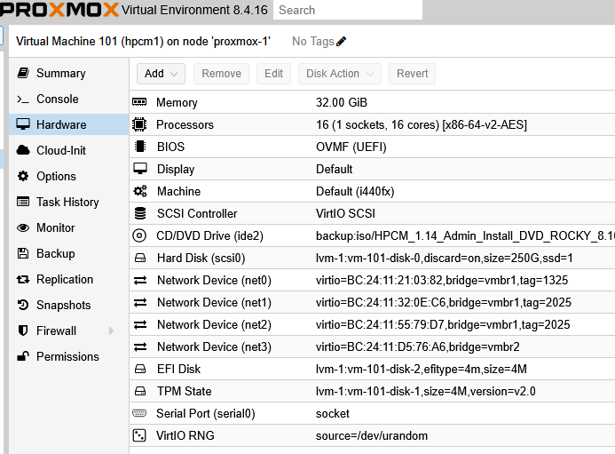
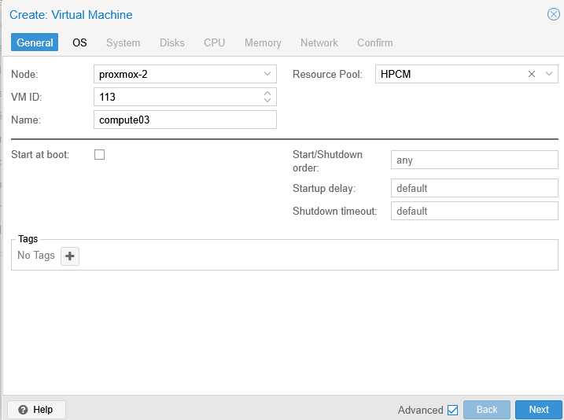
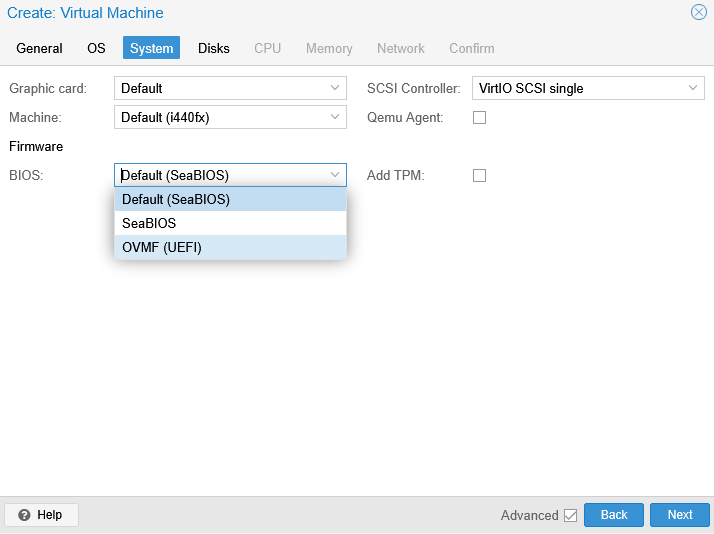
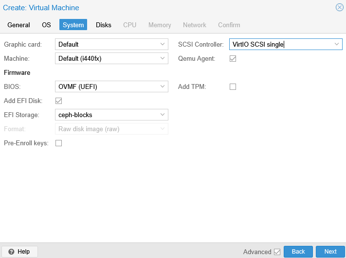
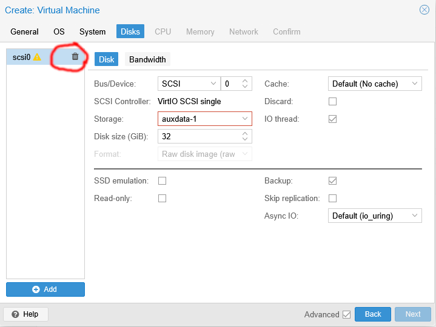
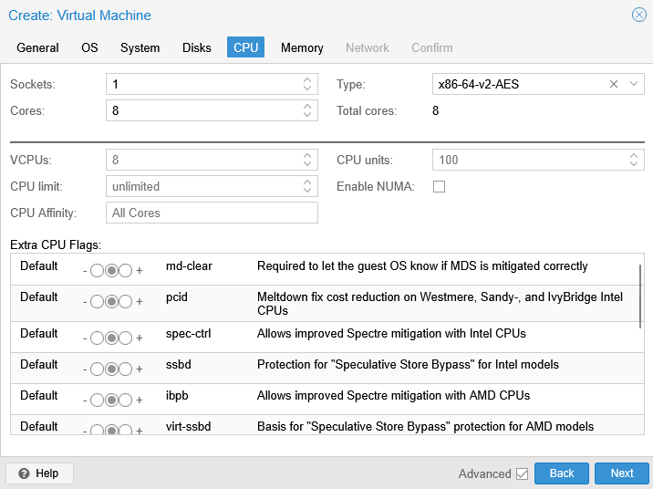
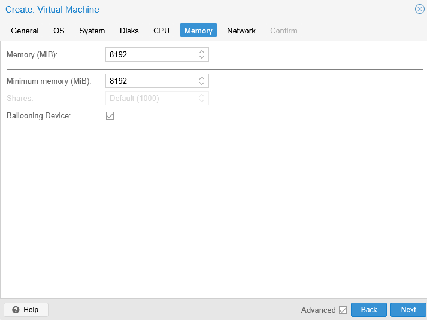
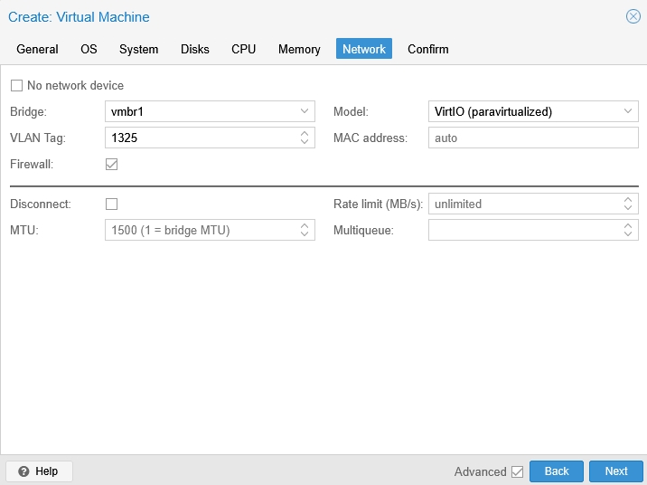
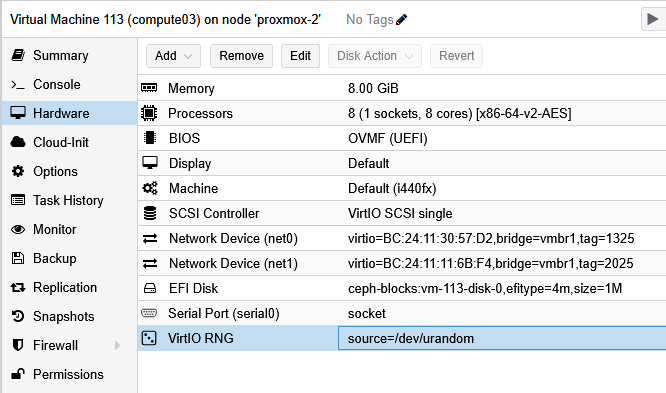

# Implementation

## Installing HPCM from an HPE provided ISO
The VM to create for the HPCM software should have:
- at least 2 network interfaces
    - one for the public network,
    - one for the HPC admin (aka "head" network)
- at least 100 GiB of disk per slot (if you want to play with slots set a virtual disk of at least 250 GiB)
- 16 GiB or RAM seems OK, I used 32 GiB but have more than 16 GiB unused (all monitoring setup, but no SU_Leaders)
- 8 cores seems OK, more if possible to speedup compression operation (image creation for example)
- a virtual CD/DVD Drive to boot on the ISO image during the HPCM installation process
- UEFI Boot is mandatory (Proxmox will require the creation of a tiny virtual disk to store the EFI parameters)

Here below the VM configuration I used for HPCM VM

Installing HPCM using the provided image with the embedded OS (here RockyLinux 8.10) is straight formward, as described in the HPCM documentation.
The VM environement does not bring any issue relative to that task.

## Setup of a Compute Node VM

The problems arise with the compute node setup.

Create a new VM using Proxmox, select an hypervisor (here proxmox-2, eventually assign it to an existing Resource Pool):

Next we do not need any OS (HPCM will provide the OS/image by mean of PXE boot)

Then select the BIOS OVMF to get UEFI boot:

Also add an EFI Storage and uncheck the Pre-Enrolle Keys box, check the Qemu Agent box as
the default images HPCM provides already provide a *qemu-guest-agent*, which will let you
transparently interact from Proxmox with the running operating system (including cleanly shutting
down the OS from Proxmox):

You don't need any disk (unless you want to setup a SU_Leader, though disks can be added once the VM has been created),
thus delete the preconfigured disk and click "next":

Choose as much CPU socket/core as you want (depending on what workload you want to have running on you HPC cluster):

Choose as much RAM as you want (and have) still depending on the workload you expect to deploy in your HPC cluster

Last set the first Network card you want, the other NIC will be added later.

Note that the "head" Virtual Network should be connected to this VM for HPCM to provide PXE boot support.

Complete the VM creation process.

To this hardware inventory has been added:
- a Virtio RNG (Random Number Generator) is **mandatory** for PXE Boot to work
- a the serial port can be added and be used as the console output of the system (optional) see [Console on Serial](console-on-serial.md)
- an additional network interface for example, the High Speed Network emulation
- the CD/DVD drive can be removed it will not be used for a compute node bootstrapped by HPCM

| [Prev](requirements.md) | [top](../README.md)   | [Next](hpcm-node-setup.md) |
|:------------------------|:---------------------:|---------------------------:|
